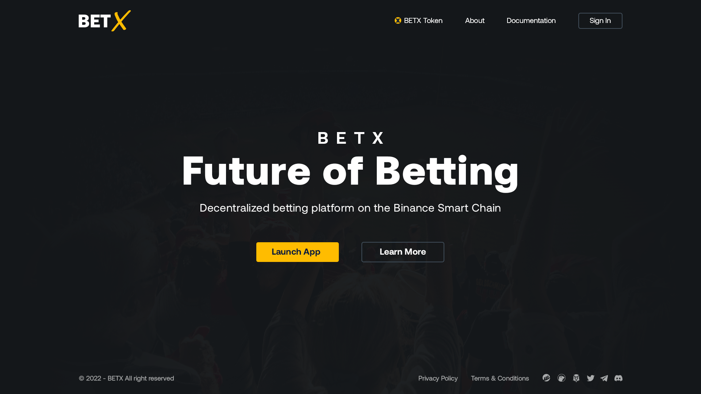

# BETX - Decentralized Sport Betting Platform

**_Future of Betting_**

BETX is a decntralized sport betting platform built on the Binance Smart Chain.
Users of the platform can create or take bets on sport events, using the the platform native currency, the BETX Token, a BEP-20 token. Bets between users are automatically handled and settled through the platform smart contract, meaning that there is no need for a bookmaker as intermediary anymore.

The Front-end and Smart Contracts have been developed by the AXP3 Studio.

## Smart Contracts

The project logic consists of two smart contracts, that have been deployed and verified on the BSC Testnet:

- **BeTX.sol** - Contract for the BETX Token, a BEP-20 utility token with finite supply used as currency within the platform. [[Contract here]](https://testnet.bscscan.com/address/0xa5752af9D450adDF7fE12872a695848FAD32F8Ee#code)
- **BetBroker.sol** - The contract handles all the platform's interactions: creating, taking, settling bets, distributing and claiming gains... [[Contract here]](https://testnet.bscscan.com/address/0xf00cC1d7Db380866C14BF459D909321183A18469#code)

## Next Steps

This project is still in Beta phase.

Future developments include implementing automated bet settlement using Chainlink Oracles to connect to off-chain data providers, and deployment to the BSC Mainnet.

## Screenshots

Screenshots of the betting platform : [[1]](screenshots/homepage.png) - [[2]](screenshots/events.png) - [[3]](screenshots/mybets.png)
